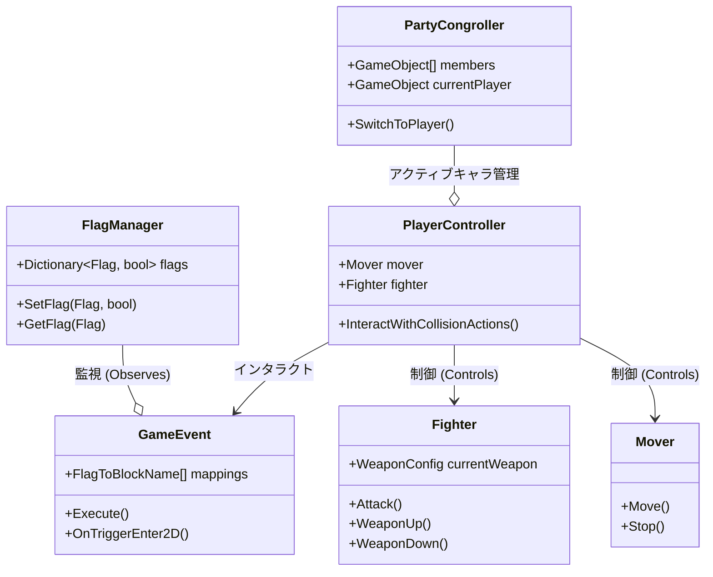

# ゲームプレイ・アーキテクチャ概要

このドキュメントは、VLCNP Storyプロジェクトの主要なゲームプレイロジックとアーキテクチャをまとめたものです。

## 1. コア・アーキテクチャ

本プロジェクトはUnity 2021.3で構築されており、WebGLをターゲットとしています。**Fungus**によるナラティブ制御と統合されたカスタムイベントシステムを持つ、コンポーネントベースのアーキテクチャを採用しています。

### 名前空間の構造
- `VLCNP.Core`: コアシステム（イベント、フラグ、ゲームループ）。
- `VLCNP.Control`: プレイヤーおよびAIのコントローラー。
- `VLCNP.Combat`: 戦闘ロジック（武器、ダメージ、発射体）。
- `VLCNP.Movement`: 移動ロジック（物理演算、アビリティ）。
- `VLCNP.Saving`: セーブ/ロードシステム。

## 2. 主要システム

### イベントシステム & ナラティブ
ゲームは会話やカットシーンに **Fungus** を使用し、カスタムスクリプトでブリッジしています。
- **`GameEvent.cs`**: Fungusのブロックをトリガーするための主要コンポーネント。
  - `Flag` EnumをFungusの **Block Name** にマッピングします。
  - **自動開始**（フラグ変更時）および **接触開始**（プレイヤーが触れた時）をサポート。
  - インタラクションUI（例：「(↑)はなす」）の表示を制御します。

### 状態管理 (Flags)
ゲームの状態はフラグによってグローバルに管理されます。
- **`FlagManager.cs`**: `Flag` (enum) と `bool` の辞書を保持します。
- **`Flag.cs`**: すべてのゲーム状態（ストーリー進行、アイテム取得など）を定義します。
- **Observerパターン**: `OnChangeFlag` イベントにより、システム（`GameEvent`など）が状態変化に即座に反応できます。

### セーブ/ロードシステム
- **`IJsonSaveable`**: 永続化が必要なコンポーネントのためのインターフェース。
  - `CaptureAsJToken()`: 状態をJSONにシリアライズ。
  - `RestoreFromJToken(JToken)`: JSONから状態を復元。
- **実装**: `FlagManager`（グローバル状態）、`PlayerController`（ステータス）、`PartyCongroller`（パーティ状態）などで使用されます。

## 3. プレイヤー & パーティシステム

### パーティ管理
- **`PartyCongroller.cs`** (シングルトンのような振る舞い):
  - キャラクター名簿（Akim, Leelee, Orochi）を管理します。
  - **キャラクター切り替え**を処理:
    - 位置、速度、状態（無敵、毒）をキャラクター間で同期。
    - `CinemachineVirtualCamera` のターゲットを管理。
  - **ステータス同期**: 経験値と「パーティヘルスレベル」をメンバー間で同期します。

### プレイヤー操作
- **`PlayerController.cs`**:
  - アクティブなキャラクターの「頭脳」となります。
  - `PlayerInputAdapter` を介して入力を読み取ります。
  - アクションを `Mover`（移動）や `Fighter`（戦闘）に委譲します。
  - `ICollisionAction` オブジェクトとのインタラクションを処理します。

### 移動ロジック
- **`Mover.cs`**: 水平速度、向き（`localScale`）、Animatorパラメータ（`vx`, `isGround`）を処理します。
- **`Leg.cs`**: `Physics2D` を使用して接地判定を行います。
- **アビリティ**: `Jump.cs`, `Dash.cs`, `KabeKickEffectController.cs`（壁ジャンプ）などのコンポーネントに分離されています。

## 4. 戦闘システム

- **`Fighter.cs`**:
  - 現在の `WeaponConfig` を管理します。
  - 入力に基づいて方向攻撃（上、下、水平）を処理します。
  - 発射体の生成や直接攻撃を実行します。
- **`WeaponConfig.cs`**: 武器のステータス（ダメージ、発射体プレハブ、クールダウン）を定義するScriptableObject。
- **`Health.cs`**: HP、無敵時間、死亡ロジックを管理します。

## 5. インタラクションシステム

- **`ICollisionAction`**: インタラクト可能なオブジェクトのためのインターフェース。
- **ワークフロー**:
  1. プレイヤーがTriggerに入る -> `PlayerController` がアクションをキャッシュ。
  2. `GameEvent`（`ICollisionAction`を実装）がUIプロンプトを表示。
  3. プレイヤーがインタラクトボタンを押す -> `PlayerController` が `Execute()` を呼ぶ。
  4. `GameEvent` が対応するFungus Blockをトリガーする。

## 6. 敵AIシステム

敵キャラクターの行動は、アクションのシーケンスを実行するステートマシンライクなシステムによって制御されています。

### コントローラー
- **`EnemyV2Controller.cs`**:
  - 敵AIの中核となるコンポーネントです。
  - `IEnemyAction` のリスト（`enemyActions`）を保持し、インデックス順にアクションを実行します。
  - **シーケンシャルな実行**: `FixedUpdate` 内で現在のアクションの `Execute()` を呼び出し、`IsDone` が true になると `Reset()` を呼んで次のアクションへ移行します。
  - **プレイヤー検知**: `IDetect` インターフェース（例：`RangeDetect`）を使用してプレイヤーを検知した場合のみ行動を開始する制御が可能です。

### アクションシステム
- **`IEnemyAction`**: 全ての敵アクションが実装するインターフェース。
  - `Execute()`: アクションのメインロジック。
  - `IsDone`: アクションが完了したかどうかのフラグ。
  - `Stop()` / `Reset()`: 中断や再利用時のリセット処理。
- **実装済みアクションの例**:
  - `Moving` / `RepeatMoving`: 移動ロジック。
  - `Fire` / `LaunchBulletToPlayer`: 遠距離攻撃。
  - `JumpAction`: ジャンプ動作。
  - `Waiting`: 一定時間の待機。

## 7. アーキテクチャ図

